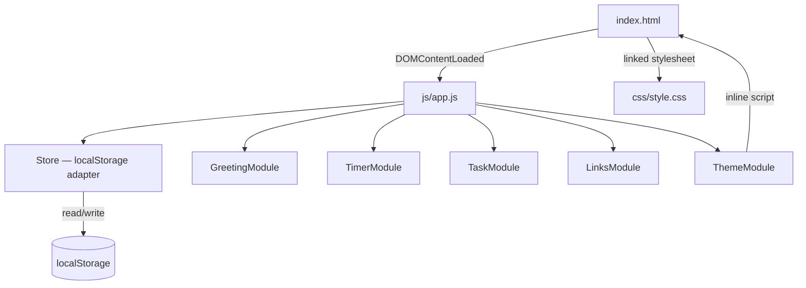

# Design Document — To-Do List Life Dashboard

## Overview

The To-Do List Life Dashboard is a zero-dependency, static single-page application (SPA) delivered as three files: `index.html`, `css/style.css`, and `js/app.js`. There is no build step, no server, and no network dependency beyond the initial file load. All state is persisted in the browser's `localStorage`.

The application is composed of five widgets that operate independently but share a single global state object and a common persistence layer:

| Widget | Purpose |
|---|---|
| Greeting | Shows time, date, and a personalised greeting |
| Focus Timer | 25-minute Pomodoro countdown with Web Audio beep |
| Task List | Full CRUD task management with sorting |
| Quick Links | User-defined shortcut buttons |
| Theme Toggle | Light/dark palette switcher |

The design follows a **module-per-widget** pattern inside a single `app.js` file. Each module exposes an `init()` function called once on `DOMContentLoaded`. Shared utilities (localStorage helpers, UUID generation, DOM helpers) are defined at the top of the file.

---

## Architecture



### Rendering model

All rendering is **imperative DOM manipulation** — no virtual DOM, no template literals with diffing. Each module owns a root DOM element (obtained once via `getElementById`) and rebuilds its list/display on every mutation. This keeps the code straightforward given the small data volumes involved (≤ 20 links, tasks bounded in practice by the 5 MB localStorage limit).

### Module communication

Modules do not call each other directly. The only cross-module dependency is:
- `GreetingModule` reads `User_Name` that `UserNameModule` writes — both read from the `Store` on demand.
- `TaskModule` emits no events; it re-reads from `Store` on every user action.

No event bus is required at this scale.

---

## Components and Interfaces

### 1. Store — localStorage Adapter

A thin wrapper around `localStorage` to centralise error handling.

```js
const Store = {
  get(key, fallback = null),      // JSON.parse; returns fallback on error
  set(key, value),                 // JSON.stringify; returns true/false
  remove(key),                     // localStorage.removeItem
};
```

All modules use `Store` exclusively. Raw `localStorage` access is never used outside this object.

### 2. GreetingModule

**Responsibility:** Display time, date, and personalised greeting. Refresh on each wall-clock minute boundary.

```js
const GreetingModule = {
  init(),       // bind DOM refs, render immediately, schedule next-minute refresh
  render(),     // update time, date, and greeting text from current Date
  _getGreeting(hour),   // pure function → "Good Morning" | "Good Afternoon" | "Good Evening" | "Good Night"
  _scheduleNextMinute() // setTimeout to next :00 boundary, then setInterval(60000)
};
```

**DOM elements owned:** `#greeting-time`, `#greeting-date`, `#greeting-text`

### 3. UserNameModule

**Responsibility:** Provide name input control; persist to / remove from localStorage.

```js
const UserNameModule = {
  init(),       // read stored name, pre-populate input
  _onSubmit(),  // validate, persist, trigger GreetingModule.render()
};
```

**DOM elements owned:** `#username-input`, `#username-submit`, `#username-error`

### 4. TimerModule

**Responsibility:** 25-minute countdown with IDLE / RUNNING / PAUSED states; Web Audio beep on completion.

```js
const TimerModule = {
  init(),
  start(),
  stop(),
  reset(),
  _tick(),                // decrements remaining, updates display; calls _complete() at 0
  _complete(),            // stops interval, shows alert, plays beep
  _playBeep(),            // Web Audio API — gracefully skipped if unsupported
  _render(),              // updates MM:SS display, enables/disables controls
  _setState(newState),    // transitions state machine, calls _render()
};
```

Internal state: `{ state: 'IDLE'|'RUNNING'|'PAUSED', remaining: number, intervalId: null|number }`

**DOM elements owned:** `#timer-display`, `#timer-start`, `#timer-stop`, `#timer-reset`, `#timer-alert`

### 5. TaskModule

**Responsibility:** Full CRUD for tasks, plus sort management.

```js
const TaskModule = {
  init(),
  _addTask(title),
  _editTask(id, newTitle),
  _deleteTask(id),
  _toggleComplete(id),
  _setSort(option),
  _getSortedTasks(),   // pure sort — does not mutate stored array
  _persist(),          // Store.set; reverts + shows error on failure
  _render(),           // full re-render of task list
  _renderTask(task),   // returns a <li> element for one task
  _enterEditMode(id),
  _exitEditMode(id, save),
};
```

Internal state: `{ tasks: Task[], sortPref: string, editingId: string|null }`

**DOM elements owned:** `#task-input`, `#task-submit`, `#task-list`, `#task-sort`, `#task-error`

### 6. LinksModule

**Responsibility:** Manage up to 20 quick-link buttons.

```js
const LinksModule = {
  init(),
  _addLink(label, url),
  _deleteLink(id),
  _normaliseUrl(url),   // pure: prepends https:// if no scheme present
  _validateUrl(url),    // pure: checks host + TLD format, length ≤ 2048
  _validateLabel(label),// pure: non-empty, length ≤ 50
  _persist(),
  _render(),
  _renderLink(link),    // returns a <div> with button + delete control
};
```

Internal state: `{ links: Link[] }`

**DOM elements owned:** `#links-form`, `#links-label`, `#links-url`, `#links-list`, `#links-error`, `#links-limit-msg`

### 7. ThemeModule

**Responsibility:** Toggle and persist light/dark theme. Apply theme without FOUC.

```js
const ThemeModule = {
  init(),         // bind toggle button; reads persisted theme
  toggle(),       // flips current theme, persists, updates <html> class
  _apply(theme),  // adds/removes 'dark' class on document.documentElement
};
```

**Inline script in `<head>` (not part of `app.js`):**
```html
<script>
  (function() {
    var t = localStorage.getItem('dashboard_theme');
    if (!t) t = window.matchMedia('(prefers-color-scheme: dark)').matches ? 'dark' : 'light';
    if (t === 'dark') document.documentElement.classList.add('dark');
  })();
</script>
```

**DOM elements owned:** `#theme-toggle`

---

## Data Models

### Task

```js
{
  id:        string,   // crypto.randomUUID() or Date.now().toString()
  title:     string,   // non-empty, trimmed
  completed: boolean,
  createdAt: string    // ISO 8601 timestamp — new Date().toISOString()
}
```

### Link

```js
{
  id:    string,  // crypto.randomUUID() or Date.now().toString()
  label: string,  // non-empty, max 50 chars
  url:   string   // valid URL, max 2048 chars, always begins with http:// or https://
}
```

### localStorage Schema

| Key | Type | Description |
|---|---|---|
| `dashboard_user_name` | `string` | Raw string (not JSON-encoded) — max 50 chars |
| `dashboard_tasks` | `JSON string` | Array of `Task` objects |
| `dashboard_sort_pref` | `string` | `"default"` \| `"alpha"` \| `"status"` |
| `dashboard_links` | `JSON string` | Array of `Link` objects |
| `dashboard_theme` | `string` | `"light"` \| `"dark"` |

All JSON keys use the same `Store.get/set` helpers. `dashboard_user_name` and `dashboard_theme` are stored as raw strings (no JSON wrapping) because they are simple scalars and must be readable by the inline `<head>` script without a JSON parse.

---

## State Management Approach

Each module holds its own **in-memory state** as a plain JavaScript object or closure variables. The general pattern:

1. **On `init()`**: Read from `Store`, populate in-memory state, call `_render()`.
2. **On user action**: Mutate in-memory state, call `_persist()`, call `_render()`.
3. **On `_persist()` failure**: Revert in-memory state mutation, call `_render()`, show error message.

This "optimistic update with rollback" pattern keeps the UI snappy while correctly handling the (rare) case where localStorage throws (e.g., storage quota exceeded).

There is no shared global state object — each module's state is local to that module's closure. The only sharing mechanism is `Store` reads.

---

## Event Handling Patterns

### Event delegation for lists

Both `TaskModule` and `LinksModule` attach a **single event listener** to their container (`#task-list`, `#links-list`) and use `event.target.closest('[data-action]')` to identify the action and the item's `data-id` attribute to find the relevant record. This avoids re-attaching listeners on every render.

```js
taskList.addEventListener('click', (e) => {
  const btn = e.target.closest('[data-action]');
  if (!btn) return;
  const id = btn.closest('[data-task-id]').dataset.taskId;
  switch (btn.dataset.action) {
    case 'toggle': TaskModule._toggleComplete(id); break;
    case 'edit':   TaskModule._enterEditMode(id);  break;
    case 'delete': TaskModule._deleteTask(id);     break;
  }
});
```

### Keyboard events

- **Enter** on the task input → `_addTask`
- **Enter** inside an edit-mode input → `_exitEditMode(id, true)`
- **Escape** inside an edit-mode input → `_exitEditMode(id, false)`

### Timer controls

Direct `addEventListener('click', ...)` on `#timer-start`, `#timer-stop`, `#timer-reset`. No delegation needed since these are static single elements.

### Form submissions

Link and username forms use `submit` event with `e.preventDefault()` to avoid page reload, then call the relevant `_add` or `_onSubmit` handler.

---

## Correctness Properties

*A property is a characteristic or behavior that should hold true across all valid executions of a system — essentially, a formal statement about what the system should do. Properties serve as the bridge between human-readable specifications and machine-verifiable correctness guarantees.*

PBT is applicable here because the core logic consists of pure functions (formatters, validators, state machines, sorters) that operate over large or infinite input spaces. The PBT library chosen is **[fast-check](https://fast-check.dev/)** (JavaScript), which integrates without a build step via a `<script type="module">` test runner (e.g., Vitest or Node test runner).

### Property 1: Greeting time formatting

*For any* `Date` object, the time-format function SHALL return a string that matches the pattern `/^\d{2}:\d{2}$/`, where the two-digit groups correctly represent the hours (00–23) and minutes (00–59) of the input date's local time.

**Validates: Requirements 1.1**

---

### Property 2: Greeting date formatting

*For any* `Date` object, the date-format function SHALL return a string that contains a recognisable weekday name, the numeric day of the month, a recognisable month name, and the four-digit full year of the input date.

**Validates: Requirements 1.2**

---

### Property 3: Greeting hour-to-message mapping is exhaustive and correct

*For any* integer hour `h` in the range [0, 23], `_getGreeting(h)` SHALL return:
- `"Good Morning"` when `h ∈ [5, 11]`
- `"Good Afternoon"` when `h ∈ [12, 17]`
- `"Good Evening"` when `h ∈ [18, 21]`
- `"Good Night"` when `h ∈ [22, 23] ∪ [0, 4]`

Every integer in [0, 23] must map to exactly one of these four strings.

**Validates: Requirements 1.3, 1.4, 1.5, 1.6**

---

### Property 4: Greeting composition with and without name

*For any* integer hour `h ∈ [0, 23]` and any valid User_Name (non-empty string of at most 50 characters), the full greeting string SHALL equal `"<time-of-day greeting>, <name>"`. *For any* hour `h` with no stored User_Name, the full greeting string SHALL equal exactly the time-of-day greeting with no suffix.

**Validates: Requirements 1.7, 1.8**

---

### Property 5: User name persistence round-trip

*For any* non-empty string `name` of length ≤ 50, submitting `name` through `UserNameModule._onSubmit()` and then calling `Store.get("dashboard_user_name")` SHALL return `name`. Additionally, calling `UserNameModule.init()` after storing `name` SHALL result in the name input's `.value` equalling `name`.

**Validates: Requirements 2.2, 2.4**

---

### Property 6: User name length validation rejects oversized input

*For any* string with `length > 50`, attempting to submit it as a User_Name SHALL leave `localStorage["dashboard_user_name"]` unchanged and SHALL cause a validation error message to be displayed.

**Validates: Requirements 2.6**

---

### Property 7: Timer MM:SS display formatting

*For any* integer `seconds ∈ [0, 1500]`, the timer format function SHALL return a string matching `/^\d{2}:\d{2}$/` where the minutes component equals `Math.floor(seconds / 60)` (zero-padded to 2 digits) and the seconds component equals `seconds % 60` (zero-padded to 2 digits).

**Validates: Requirements 3.2, 3.3**

---

### Property 8: Timer stop-then-resume preserves remaining time

*For any* integer `remaining ∈ [1, 1500]`, setting the timer to RUNNING state with that remaining value and then calling `stop()` SHALL leave `remaining` unchanged (state transitions to PAUSED). Subsequently calling `start()` and advancing one tick SHALL decrement `remaining` by exactly 1.

**Validates: Requirements 3.4, 3.9**

---

### Property 9: Timer reset always produces canonical IDLE state

*For any* timer state (IDLE, RUNNING, or PAUSED) and *for any* remaining value, calling `reset()` SHALL set `remaining` to 1500, transition state to IDLE, and update the display to "25:00".

**Validates: Requirements 3.5**

---

### Property 10: Timer control enablement invariants

*For any* valid timer state, the following must hold simultaneously:
- When state = RUNNING: the Start button is disabled and the Stop button is enabled.
- When state = IDLE or PAUSED: the Stop button is disabled and the Start button is enabled.

**Validates: Requirements 3.7, 3.8**

---

### Property 11: Task creation produces correctly shaped objects

*For any* non-empty, non-whitespace string `title`, calling `_addTask(title)` SHALL create a Task where: `id` is a non-empty string, `title` equals the trimmed input, `completed` is `false`, and `createdAt` is a valid ISO 8601 date string parseable by `new Date()`.

**Validates: Requirements 4.2**

---

### Property 12: Whitespace-only task titles are rejected

*For any* string composed entirely of Unicode whitespace characters (space, tab, newline, etc.), calling `_addTask(str)` SHALL not increase the task list length, SHALL not write a new task to `localStorage["dashboard_tasks"]`, and SHALL display the error message "Task title cannot be empty".

**Validates: Requirements 4.3**

---

### Property 13: Task list persistence round-trip

*For any* sequence of valid task additions, `Store.get("dashboard_tasks")` SHALL return an array that contains every added task. After calling `TaskModule.init()` with any non-empty stored task array, the number of rendered `<li>` elements SHALL equal the length of the stored array and each rendered title SHALL match its corresponding stored task's `title` field.

**Validates: Requirements 4.4, 4.5**

---

### Property 14: Edit mode pre-populates with current title

*For any* task with title `t`, entering edit mode for that task SHALL result in the edit input's `.value` equalling `t`.

**Validates: Requirements 5.2**

---

### Property 15: Confirmed edit persists new title

*For any* task with title `original` and *for any* non-empty, non-whitespace new title `updated`, confirming the edit SHALL result in `Store.get("dashboard_tasks")` containing a task with the same `id` and `title === updated`. The `original` title SHALL no longer appear for that task.

**Validates: Requirements 5.3**

---

### Property 16: Edit exit without save preserves original title

*For any* task with title `original`, exiting edit mode without saving — either by confirming with a whitespace-only value, or by pressing Escape with any modified input — SHALL leave the task's stored `title` equal to `original` and SHALL restore the rendered title display to `original`.

**Validates: Requirements 5.4, 5.5**

---

### Property 17: Completion toggle is an involution

*For any* task with completion status `c ∈ {true, false}`, calling `_toggleComplete(id)` SHALL set the stored task's `completed` to `!c`. Calling `_toggleComplete(id)` a second time SHALL restore `completed` to `c` (toggle is its own inverse).

**Validates: Requirements 6.2**

---

### Property 18: Deletion removes task from persisted list

*For any* task list of length `n ≥ 1` and *for any* task `T` in that list, calling `_deleteTask(T.id)` SHALL result in `Store.get("dashboard_tasks")` having length `n - 1` and containing no task with `id === T.id`.

**Validates: Requirements 6.4**

---

### Property 19: Sort does not mutate stored task order

*For any* array of tasks and *for any* sort option ("default", "alpha", "status"), applying a sort SHALL change only the rendered display order; `Store.get("dashboard_tasks")` SHALL return the same array in the same insertion order as before the sort was applied.

**Validates: Requirements 7.2**

---

### Property 20: Task mutation resets active non-default sort

*For any* active sort preference `s ∈ {"alpha", "status"}` and *for any* task mutation (add, delete, toggle, or title edit), after the mutation `Store.get("dashboard_sort_pref")` SHALL equal `"default"` and the rendered task order SHALL reflect creation order.

**Validates: Requirements 7.3**

---

### Property 21: Sort preference persistence round-trip

*For any* sort option `s ∈ {"default", "alpha", "status"}`, selecting `s` SHALL persist it so that `Store.get("dashboard_sort_pref") === s`. After calling `TaskModule.init()` with that preference stored, the active sort SHALL equal `s` and the rendered list order SHALL reflect that sort.

**Validates: Requirements 7.4, 7.5**

---

### Property 22: URL scheme normalisation always produces a scheme-prefixed URL

*For any* URL string that does not begin with `"http://"` or `"https://"`, calling `_normaliseUrl(url)` SHALL return a string that begins with `"https://"` and ends with the original `url` value. *For any* URL string that already begins with `"http://"` or `"https://"`, `_normaliseUrl(url)` SHALL return the URL unchanged.

**Validates: Requirements 8.4**

---

### Property 23: Link persistence round-trip

*For any* valid label (non-empty, ≤ 50 chars) and valid URL (valid host, ≤ 2048 chars), calling `_addLink(label, url)` SHALL result in `Store.get("dashboard_links")` containing a Link object with `label` equal to the submitted label and `url` equal to `_normaliseUrl(url)`.

**Validates: Requirements 8.2**

---

### Property 24: Link deletion removes from persisted list

*For any* link list of length `n ≥ 1` and *for any* Link `L` in that list, calling `_deleteLink(L.id)` SHALL result in `Store.get("dashboard_links")` having length `n - 1` and containing no link with `id === L.id`.

**Validates: Requirements 8.7**

---

### Property 25: Link count limit invariant

*For any* link list of length `n`:
- When `n ≥ 20`: the link submission control SHALL be disabled and the message "Maximum 20 links reached" SHALL be visible.
- When `n < 20`: the link submission control SHALL be enabled and the limit message SHALL not be visible.

**Validates: Requirements 8.9**

---

### Property 26: Theme toggle is an involution

*For any* active theme `t ∈ {"light", "dark"}`, calling `ThemeModule.toggle()` SHALL persist the opposite theme (`"light"` ↔ `"dark"`) to `localStorage["dashboard_theme"]` and apply the corresponding class to `document.documentElement`. Calling `toggle()` a second time SHALL restore the original theme state.

**Validates: Requirements 9.2**

---

## Error Handling

### localStorage failures

The `Store.set()` method wraps `localStorage.setItem` in a try/catch and returns `false` on failure. All mutating operations in `TaskModule` and `LinksModule` check the return value of `Store.set()`. On failure:

1. The in-memory state is reverted to its pre-mutation snapshot.
2. `_render()` is called to re-sync the DOM.
3. An error message element is shown to the user (e.g., "Could not save changes. Storage may be full.").

This pattern is consistent across `_toggleComplete`, `_deleteTask`, `_addTask`, `_editTask`, `_addLink`, `_deleteLink`.

### Web Audio API unavailability

`TimerModule._playBeep()` wraps the `AudioContext` construction in a try/catch. If the browser does not support `AudioContext`, or if the context is blocked (e.g., due to autoplay policy before user interaction), the beep is silently skipped. The visual alert still fires.

### localStorage read failures

`Store.get()` wraps `JSON.parse` in a try/catch and returns the provided `fallback` value (default `null`). Modules treat a `null` result as an empty / missing value and initialise with safe defaults (empty array for tasks and links, `null` for user name, system preference for theme).

### Input validation

All user-facing inputs are validated before any state mutation or persistence:
- Empty/whitespace titles → show inline error, abort.
- Oversized strings → show inline error, abort.
- Invalid URLs → show inline error, abort.
- Empty link fields → show inline error, abort.

Inline error messages are cleared on the next valid interaction.

---

## Testing Strategy

### Dual testing approach

The project uses two complementary test layers:

1. **Unit tests (example-based)** — test specific examples, edge cases, integration points (DOM wiring, keyboard events, UI state changes).
2. **Property tests (PBT)** — test universal properties (formatters, validators, state machines, sort logic, round-trips) across a large, randomised input space.

### Property-based testing configuration

**Library:** [fast-check](https://fast-check.dev/) — loaded via CDN or npm, run in a Node.js test runner (e.g., Vitest `--run`).

**Minimum iterations:** 100 per property (fast-check default is 100 runs; increase to 1000 for simple pure functions).

**Test file structure:**
```
tests/
  unit/
    greeting.test.js
    timer.test.js
    tasks.test.js
    links.test.js
    theme.test.js
  property/
    greeting.property.test.js   // Properties 1–4
    timer.property.test.js      // Properties 7–10
    tasks.property.test.js      // Properties 11–21
    links.property.test.js      // Properties 22–25
    theme.property.test.js      // Property 26
```

**Tag format for property tests:**

Each property test must include a comment referencing its design property:
```js
// Feature: todo-life-dashboard, Property 3: Greeting hour-to-message mapping is exhaustive and correct
fc.assert(
  fc.property(
    fc.integer({ min: 0, max: 23 }),
    (hour) => {
      const result = _getGreeting(hour);
      if (hour >= 5 && hour <= 11) return result === 'Good Morning';
      if (hour >= 12 && hour <= 17) return result === 'Good Afternoon';
      if (hour >= 18 && hour <= 21) return result === 'Good Evening';
      return result === 'Good Night';
    }
  ),
  { numRuns: 100 }
);
```

### Unit test focus areas

- **Timer state machine transitions**: IDLE → RUNNING → PAUSED → IDLE (example sequences)
- **Keyboard events**: Enter to confirm edit, Escape to cancel
- **DOM integration**: ensure rendered elements have correct data attributes
- **Error display**: localStorage write failure triggers revert + error message
- **FOUC prevention**: inline `<head>` script applies class before body renders
- **Theme on load**: prefers-color-scheme fallback when localStorage is empty

### What is NOT property-tested

- CSS rendering and visual styling — use manual review + browser DevTools
- WCAG contrast ratios — use automated accessibility tools (axe, Lighthouse)
- Cross-browser compatibility — use BrowserStack or manual testing
- Performance (DOMContentLoaded < 2 s) — use Lighthouse CI
- Responsive layout (320 px–1920 px) — use browser DevTools responsive mode
